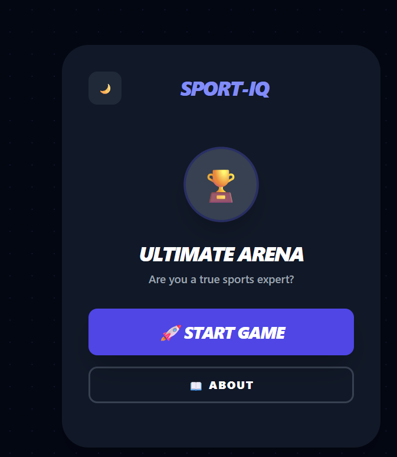
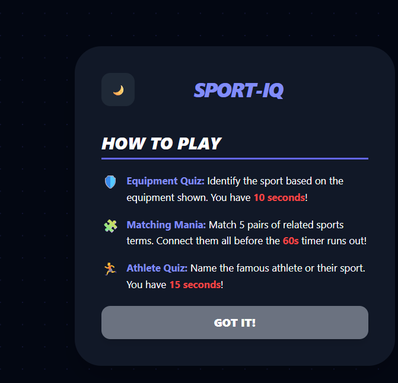
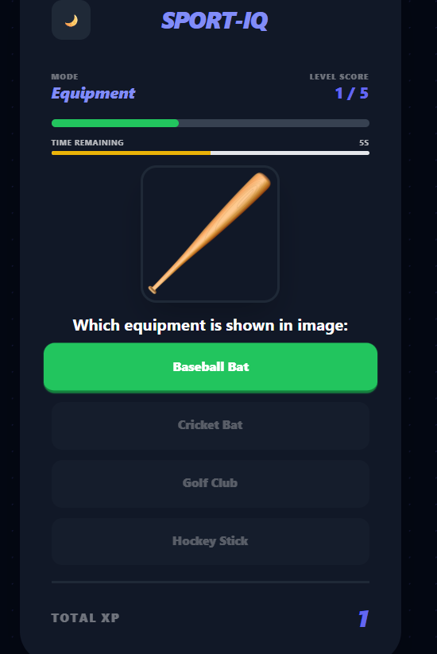
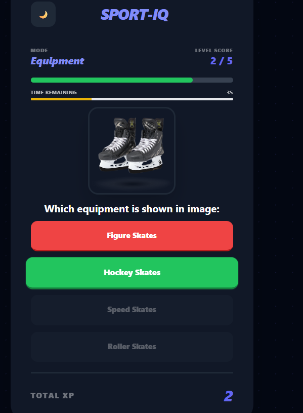
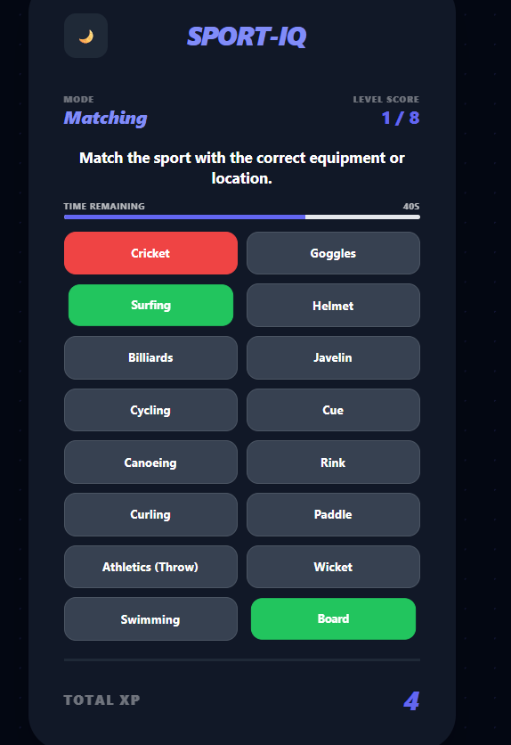
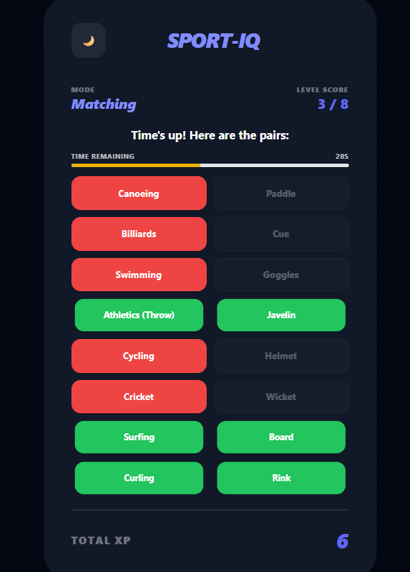
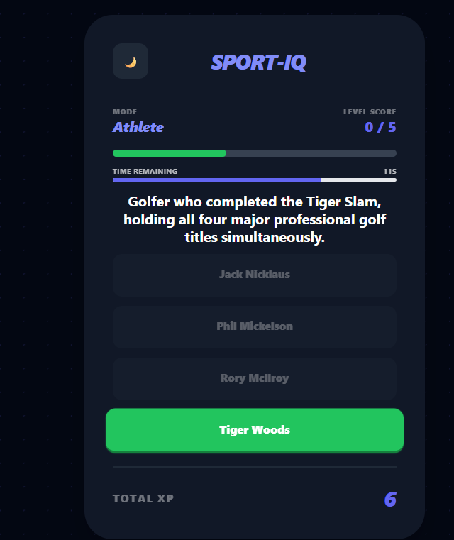
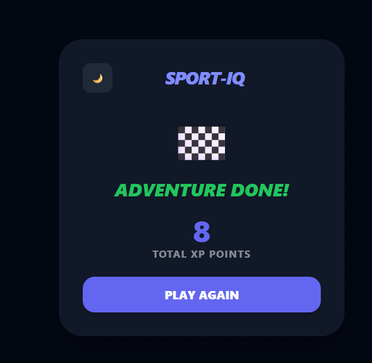

# Sport Quiz – Full‑Stack Clojure Web Application

A **full‑stack web quiz game** built entirely in **Clojure** and **ClojureScript**.  
The application runs in the browser and challenges players through **three different sports‑themed mini‑games**, combining time pressure, visual recognition, and logical matching.

The project demonstrates a clean separation between **frontend (Reagent / ClojureScript)** and **backend (Ring / Compojure / http-kit)**, with a simple HTTP API, centralized state handling, and a modular UI component structure.

---

## Project Overview

The game consists of **three consecutive stages**:

1. **Equipment Quiz**  
   Players have **10 seconds** per question to identify a sports equipment item shown in an image.

2. **Matching Game**  
   Players have **60 seconds** to correctly match sports concepts from the left and right columns.

3. **Guess the Athlete**  
   Players have **15 seconds** to answer which athlete is described by the given question.

After completing all stages, the game ends with a **final score screen** displaying the total number of points earned.

The application is fully browser‑based and runs locally on **http://localhost:3000**.

---

## Application Flow

1. The user opens the application in the browser.
2. The **Main Menu** is displayed.
3. Clicking **START GAME** begins the quiz sequence.
4. The player progresses through all three games in order.
5. A **Game Over** screen displays the final score.

---

## Screenshots

The following images are located in `resources/pictures/`:

- **Main menu**  
  

- **About / How to Play**  
  

### Equipment Quiz

- Correct answer example  
  

- Wrong answer example  
  

### Matching Game

- Connecting pairs during the game  
  

- Finished state (time expired or all pairs attempted)  
  

### Guess the Athlete

- Correctly answered question  
  

### Game Over

- Final score screen  
  

---

## Project Structure

```
sport_quiz/
├── src/
│   └── sport_quiz/          # Backend (Clojure)
│       ├── server.clj       # HTTP server, routes, request/response handling
│       ├── state_engine.clj # Core game logic and backend state engine
│       └── db/
│           ├── core.clj     # Database connection and setup
│           └── queries.clj  # SQL queries and DB operations
│
├── src-cljs/
│   └── sport_quiz/          # Frontend (ClojureScript / Reagent)
│       ├── api.cljs         # HTTP API calls to the backend
│       ├── state.cljs       # Application state (Reagent atoms)
│       ├── core.cljs        # Main menu, About view, Game Over view
│       └── components/
│           ├── classic_quiz.cljs   # Equipment quiz & Guess the Athlete UI
│           ├── matching_game.cljs  # Matching game UI
│           └── common.cljs         # Shared UI components (timer, progress bar, styles)
│
├── resources/
│   └── public/
│       └── js/              # Compiled ClojureScript output (main.js)
│
├── project.clj               # Leiningen project configuration
├── shadow-cljs.edn           # Shadow CLJS build configuration
└── README.md
```

---

## Backend Architecture

The backend is implemented using **Ring** and **Compojure**, and runs on **http-kit**.

### Key Files

- **`server.clj`**  
  - Starts the HTTP server.
  - Defines API routes.
  - Handles incoming requests from the frontend and returns JSON responses.

- **`state_engine.clj`**  
  - Core application engine.
  - Contains the main game logic and state transitions.
  - Acts as a clean API layer between the frontend and backend.

- **`db/core.clj` & `db/queries.clj`**  
  - Database connectivity and SQL queries.
  - Uses MySQL with migrations handled by **Migratus**.

---

## Frontend Architecture

The frontend is written in **ClojureScript** using **Reagent**, a minimalistic React wrapper.

### State Management

- Application state is stored in **Reagent atoms** (`state.cljs`).
- State updates trigger reactive UI re‑renders, similar to `useState` in React.

### Components

- **`core.cljs`**  
  Main menu, About screen, and Game Over view.

- **`classic_quiz.cljs`**  
  Visual components for:
  - Equipment quiz
  - Guess the Athlete game

- **`matching_game.cljs`**  
  Drag‑and‑match style game for pairing sports concepts.

- **`common.cljs`**  
  Shared UI elements:
  - Timers
  - Progress bars
  - Reusable styling helpers

---

## Technologies & Libraries

### Backend

- **Clojure** – core language  
  https://clojure.org/

- **Ring** – HTTP server abstraction  
  https://github.com/ring-clojure/ring

- **Compojure** – routing library  
  https://github.com/weavejester/compojure

- **http-kit** – high‑performance web server  
  https://http-kit.github.io/

- **Cheshire** – JSON encoding/decoding  
  https://github.com/dakrone/cheshire

- **MySQL Connector/J** – database driver  
  https://dev.mysql.com/doc/connector-j/en/

- **Migratus** – database migrations  
  https://github.com/yogthos/migratus

### Frontend

- **ClojureScript**  
  https://clojurescript.org/

- **Reagent** – React wrapper for ClojureScript  
  https://reagent-project.github.io/

- **Shadow CLJS** – build tool for ClojureScript  
  https://shadow-cljs.github.io/docs/UsersGuide.html

- **cljs-ajax** – HTTP requests from ClojureScript  
  https://github.com/JulianBirch/cljs-ajax

---

## How to Run the Application

### Prerequisites

- **Java JDK**
- **Leiningen**
- **Node.js** and **npm**

---

### Installation & Startup

1. **Clone the repository**

```bash
git clone https://github.com/BoBi1537/sport_quiz.git
cd sport_quiz
```

2. **Install frontend dependencies**

```bash
npm install
```

This installs React and related dependencies required by Reagent.

3. **Compile ClojureScript**

```bash
npx shadow-cljs release app
```

This command compiles the frontend and generates `main.js` inside `resources/public/js`.

4. **Start the backend server**

```bash
lein run
```

The server starts on:

```
http://localhost:3000
```

5. **Open the application**

Open your browser and navigate to:

```
http://localhost:3000
```

---

## Testing

Midje is used for backend testing.

To run tests:

```bash
lein midje
```

---

## Notes

- The application is intentionally built with **clear separation of concerns** between frontend and backend.
- The game engine logic is centralized in the backend to keep the frontend focused on presentation and interaction.
- The architecture is designed to be easily extendable with new game modes, questions, or scoring rules.

---

## License

Copyright © 2026

This program and the accompanying materials are made available under the
terms of the Eclipse Public License 2.0 which is available at:

https://www.eclipse.org/legal/epl-2.0/

This Source Code may also be made available under the following Secondary
Licenses when the conditions for such availability set forth in the Eclipse
Public License, v. 2.0 are satisfied: GNU General Public License, version 2
or later, with the GNU Classpath Exception:

https://www.gnu.org/software/classpath/license.html

